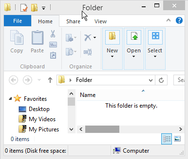
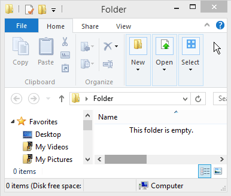

# Windows 8 / 10 Explorer Titlebar Context Menu Bug Fix

When you right-click the title bar in Windows Explorer (Windows 8 and 10) and select an option, it will erroneously re-display the context menu again, leaving the menu hanging there until you click something else to close it. This is a fix. 

Bug also mentioned here: http://www.askvg.com/windows-8-bug-report/. Video of the bug: https://www.youtube.com/watch?v=EhLLF5B6VMA

| **Before the fix:**   | **After the fix:** |
|--------------------- |------------------|
|  |  |

## Installation Instructions

There are two ways to install and set this up to boot with windows. Once running, you should see the AutoHotkey icon  running in your system tray in the bottom right corner of your screen.

**Simple:**

* Download [windows-explorer-context-bug.exe](https://github.com/patricknelson/windows-explorer-context-bug/raw/master/windows-explorer-context-bug.exe) to your computer.
* Double click the `windows-explorer-context-bug.exe` file downloaded above to run the fix.

**From Source:**

If you prefer to be safer and also have the ability to tinker with the code, you can also run from source. This only requires that you already have [AutoHotkey](http://www.autohotkey.com/) installed. 

* Download and install AutoHotkey from [http://www.autohotkey.com/](http://www.autohotkey.com/).
* Right click here: [windows-explorer-context-bug.ahk](https://github.com/patricknelson/windows-explorer-context-bug/raw/master/windows-explorer-context-bug.ahk) and select "Save as..." to download to your computer.
* Double click the `windows-explorer-context-bug.ahk` file downloaded above to run the fix. 

**Run at Startup (Optional):**

To ensure this works every time you start your computer, you'll need to perform a few additional simple steps:

  * Press the Windows Key + R to open the "Run" dialog.
  * Type (or paste) the following and click OK. This should open the windows "Startup" folder: `shell:startup`
  * Right click the downloaded `.exe` or `.ahk` file and select "Copy".
  * Right click inside the "Startup" folder and select "Paste shortcut".
